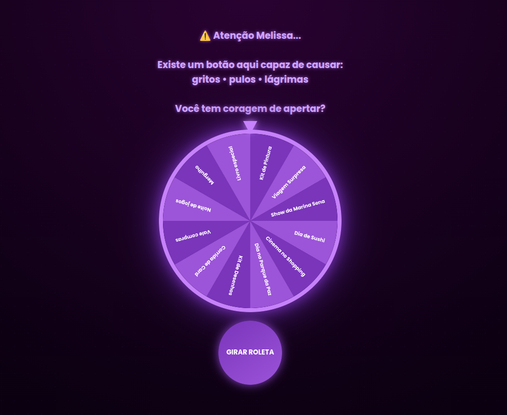

# 🎁 Melissa Birthday Surprise

Uma experiência interativa criada para revelar um presente especial de aniversário.

Este projeto apresenta uma **roleta animada com efeitos visuais, sons e suspense**, que revela no final o verdadeiro presente:
🎤 **Ingressos para o show da Marina Sena.**

O objetivo foi criar um momento emocionante e inesquecível para minha filha.

---

## ✨ Funcionalidades

* 🎡 Roleta animada usando **Canvas API**
* 🎵 Efeitos sonoros durante o giro
* 🎉 Confetes animados na revelação
* 🎤 Modal de prêmio com o anúncio do show
* 💜 Luzes de palco e efeitos visuais
* 🎯 Experiência interativa com suspense

---

## 🛠️ Tecnologias utilizadas

* **HTML5**
* **CSS3**
* **JavaScript**
* **Canvas API**

---

## 📸 Preview



---

## 🚀 Como executar o projeto

1. Clone o repositório

```
git clone https://github.com/SEU-USUARIO/melissa-birthday-surprise.git
```

2. Entre na pasta do projeto

```
cd melissa-birthday-surprise
```

3. Abra o arquivo `index.html` no navegador.

---

## 📂 Estrutura do projeto

```
melissa-birthday-surprise
│
├── index.html
├── style.css
├── script.js
│
├── assets
│   ├── marina.webp
│   ├── premio.jpeg
│   ├── roleta.mpeg
│   └── marina.mpeg
│
├── images
│   └── page.png
│
└── README.md
```

---

## 🎯 Objetivo do projeto

Criar uma experiência interativa divertida para revelar um presente de aniversário de forma emocionante.

---

## ❤️ Autor

Desenvolvido com carinho por um pai para sua filha.

**Jackson Garcia**

---
